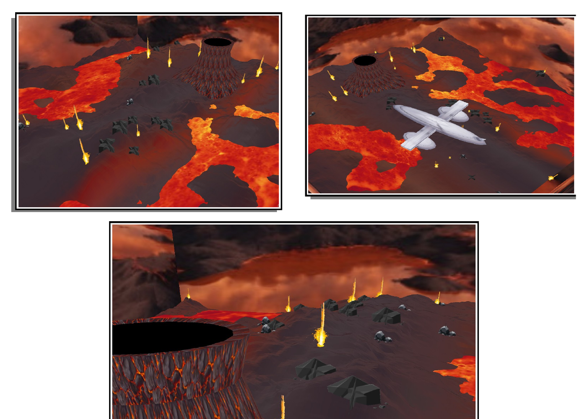

# Volcanic World — Projet graphique 3D en C++

[](https://isocpp.org/)
[](https://www.opengl.org/)
[](#résultat)

[English version](README.md) · **Français**

Projet universitaire de programmation graphique réalisé en C++ avec un framework OpenGL fourni par l’Université Claude Bernard Lyon 1.

L’objectif était de créer une scène 3D comprenant :

- un objet complexe construit à partir de formes géométriques simples ;
- un terrain texturé ;
- des billboards ;
- une animation ;
- une cubemap autour de la scène.



## Mon idée

J’ai choisi de transformer la scène classique proposée dans le projet en un monde volcanique.

Au lieu d’utiliser un terrain vert, j’ai créé un environnement composé de roche et de magma. L’eau a été remplacée par de la lave, et les billboards ont été utilisés pour représenter des jets de lave et des roches répartis sur le terrain.

L’objet complexe demandé est un avion construit à partir de plusieurs formes de base, notamment des sphères, des cubes, des cylindres et des cônes.

## Fonctionnalités principales

- création de formes simples : cube, sphère, cylindre, disque et cône ;
- construction d’un avion à partir de ces formes ;
- génération d’un terrain à partir d’une carte de hauteur ;
- application de textures de magma et de lave ;
- création d’un volcan en faisant tourner un profil 2D autour d’un axe ;
- calcul des normales pour l’éclairage ;
- affichage de jets de lave et de roches avec des billboards ;
- ajout d’une cubemap volcanique ;
- animation de l’avion à travers la scène.

## Technologies et concepts

- C++
- OpenGL
- maillages 3D
- textures
- transformations géométriques
- cartes de hauteur
- billboards
- cubemap
- calcul vectoriel
- animation et interpolation

## Fichiers principaux

```text
.
├── src/
│   ├── Viewer_etudiant.h
│   └── Viewer_etudiant.cpp
├── data/
│   ├── terrain/
│   ├── billboard/
│   └── cubemap/
├── docs/
│   ├── project-report.pdf
│   └── screenshots/
├── README.md
└── README.fr.md
```

La majorité de mon travail se trouve dans `Viewer_etudiant.cpp` et `Viewer_etudiant.h`.

Le rapport complet du projet est disponible ici : [`docs/project-report.pdf`](docs/project-report.pdf).

## Exécution

Ce dépôt contient uniquement les fichiers étudiants que j’ai conservés.

Le framework graphique fourni par l’université ainsi que certains fichiers de données ne sont plus disponibles. Le projet ne peut donc pas être compilé directement dans son état actuel.

Les captures d’écran et le rapport permettent néanmoins de voir le résultat final et les différentes étapes de l’implémentation.

## Résultat

**Note obtenue : 16,5/20**

## Auteur

**Leopold Nahas**
